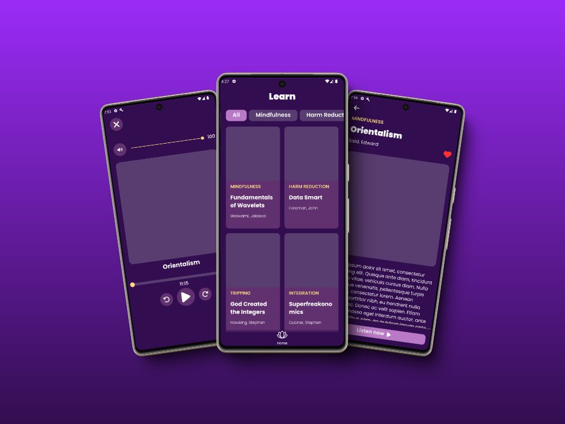

# Z1 Digital React Native Tech Test



## About The Project

This project is a technical test for Z1 Digital, implementing a React Native application that fetches and displays items from a GraphQL API. The app includes features such as filtering items by type, a detailed view for each item, and an audio player functionality.

### Built With

- React Native
- TypeScript
- Styled Components
- GraphQL
- Apollo Client
- React Navigation
- React Native Track Player

### Related Considerations

- In typical projects, I would have used [shopify/restyle](https://shopify.github.io/restyle) for component and view styling. I'm more familiar with this library, and it generally offers easier development and improved usability. However, for this test, I adhered to the suggested styled-components approach.

- I considered implementing [Redux](https://redux-toolkit.js.org/) for data management and global state handling. However, given the limited scope of this test—with only one API request and a small number of screens—I decided it wasn't necessary. Apollo Client's local state management capabilities were sufficient for this project's needs.

These decisions were made to balance best practices with the specific requirements of this technical test, focusing on demonstrating the requested skills and technologies.

## Getting Started

Follow these steps to set up and run the project on your local machine.

### Prerequisites

Before you begin, ensure you have the following installed:

- [yarn](https://yarnpkg.com/)
- React Native development environment set up for Android

### Installation

1. Clone the project

   ```bash
   git clone https://github.com/your_username/z1-react-native.git

   ```

2. Go to the project directory

```bash
  cd z1-react-native
```

3. Install dependencies

```bash
  yarn install
```

4. Start the server

```bash
  yarn android
```

## Lessons Learned

Throughout this technical test, I had the opportunity to explore and learn several new tools. Although some were optional, I decided to incorporate them to expand my knowledge and challenge myself. I enjoy facing new challenges and am always eager to learn whatever is necessary.

### Key Takeaways

- **Styled Components**
  I found this library interesting and flexible, as it can be used for both web and mobile development. However, I found it somewhat uncomfortable when creating reusable components and less intuitive compared to other libraries for style and theme management. Despite these challenges, it was a valuable learning experience.
  Maybe my limited experience and not knowing how to use this library properly led me to think this way, or maybe I am doing something wrong, which is most likely.

- **GraphQL & Apollo Client**
  I found the combination of GraphQL and Apollo Client very intriguing. The ability to construct requests with only the necessary information was fantastic, and the data fetching process seemed very straightforward. The efficiency and flexibility of this approach impressed me, and I plan to continue exploring and learning more about these technologies.

These experiences have broadened my skill set and given me new perspectives on different approaches to React Native development. While some tools presented challenges, overcoming these obstacles has contributed to my growth as a developer.

## Acknowledgements

I would like to express my sincere gratitude to the entire team at Z1 Digital for giving me the opportunity to complete this technical test. It has been an extremely enriching experience, and I thoroughly enjoyed the process.

I did my best and am very happy with the result. This test not only allowed me to demonstrate my current skills but also offered me the chance to learn and grow as a developer.

Thank you again for this opportunity. I look forward to the possibility of collaborating with you in the future.

## Feedback

If you have any feedback, please reach out to me at juanmanuelgomezomil@gmail.com
